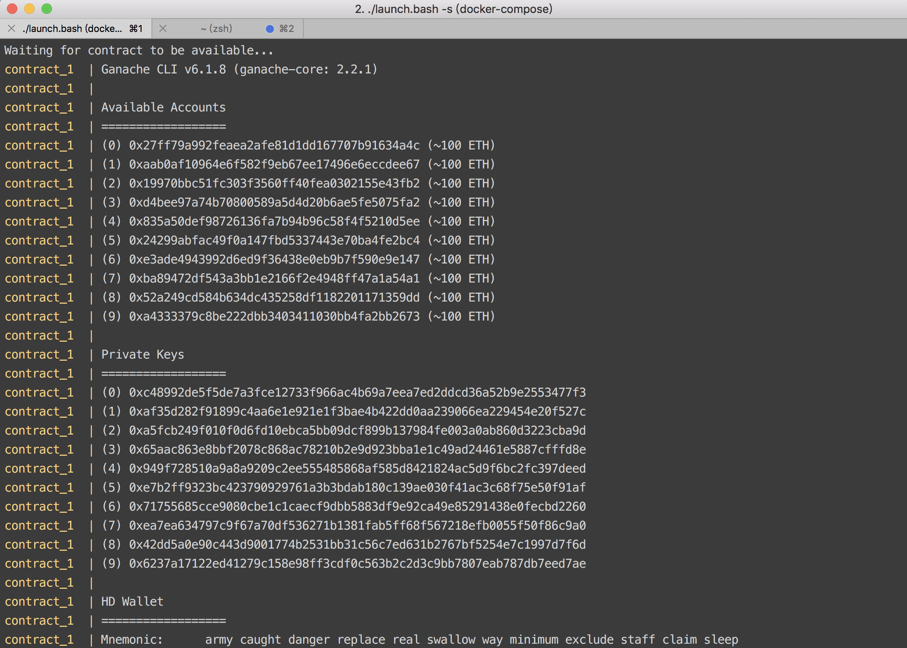
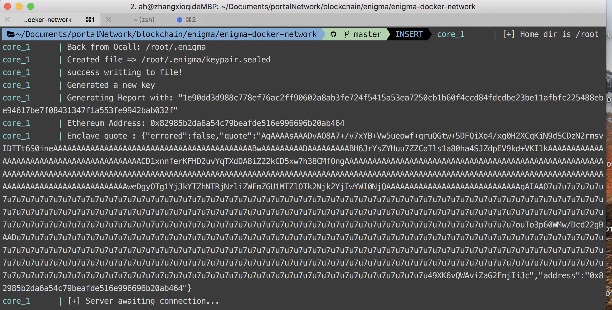
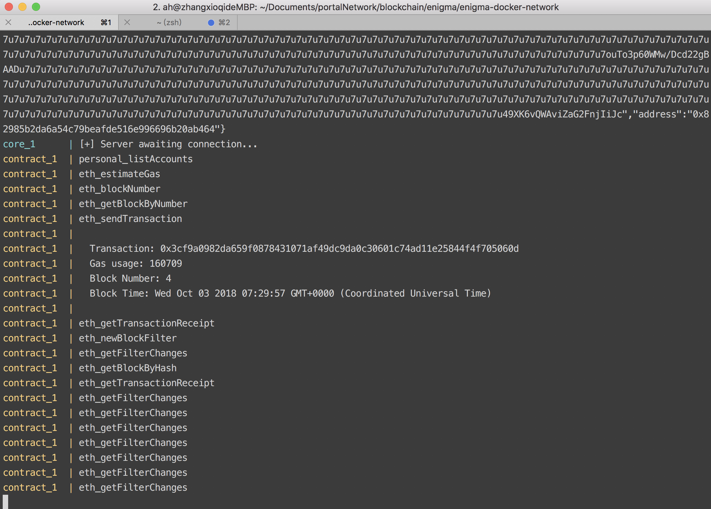
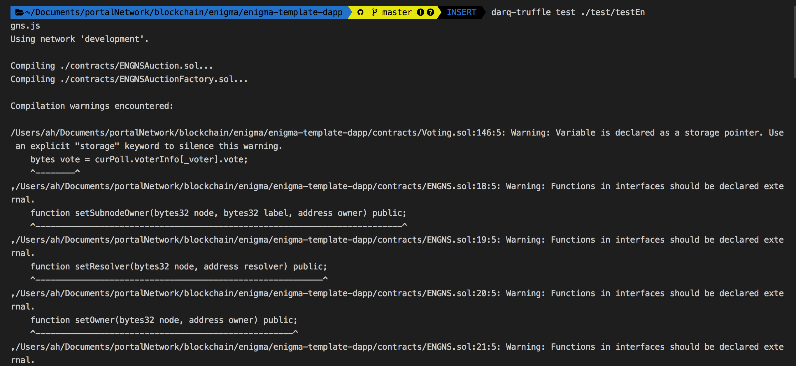
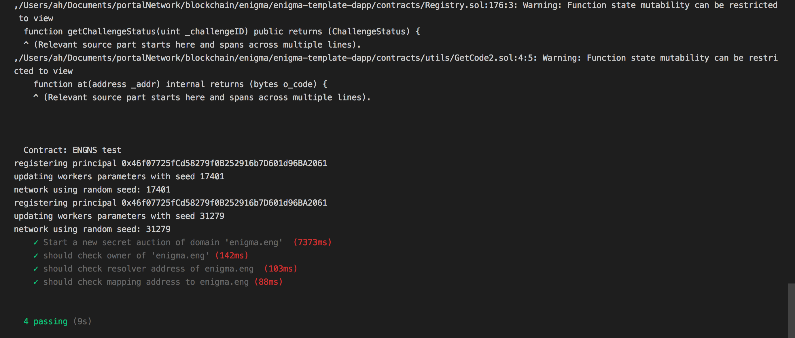

# Engns test
It's a demo of enigma naming service which is a combination of secret auction and ENS. Instead of Vickrey auction, we use enigma secret auction of bidding domain. Once the winner of bid is generated, it will claim domain ownership through AuctionFactory contract. Thus domain owner can use naming service through registry.

## Prerequisite
Enigma test network deployed.
1. Clone the [enigma-docker-network](https://github.com/enigmampc/enigma-docker-network) project and change to the directory just cloned.
```
git clone https://github.com/enigmampc/enigma-docker-network.git
cd enigma-docker-network
```

2. Enigma officially provides a script of setting up local testnet. It will automatically download all the necessary packages, setting up testnet and deploying default contracts within it. Execute the command:
```
./launch.bash -s
```

Stop Enigma docker
```
./launch.bash -q
```

- `-t` : Spawn a terminal for every container/process. It's optional. You need to have xterm installed. Comes by default in Linux distributions. In MacOS, you need to install [XQuartz](https://www.xquartz.org/).
- `-s` : Run in simulation mode. It's necessary for running the `software mode`

As you can see, it deploys a private network on localhost like [ganache-cli](https://github.com/trufflesuite/ganache-cli).




## Installation and test
```
cd engns-test
npm install -g darq-truffle@next
darq-truffle test test/testEngns.js
```

## ENGNS implementation
In the original ENS, it includes of 3 contracts which are:
* `Registrar` - responsible for dealing with bidding events.
* `Registry`  - responsible for registering domain owner.
* `Resovler`  - responsible for resolving binded contents of domain.

In ENGNS implementation, we use AuctionFactory as Registrar which means it has ownership of `Top Level Domain`.
* `Top Level Domain`: In this demo, TLD is `eng`.

## Register domain demo step by step
1. Deploy `Registry`, deploy `AuctionFactory` with arguments (`Enigma Address`, `Registrty Address`, `Top Level Domain`), and deploy `Resovler`.
- `AuctionFactory`: responsible for creating new bid contracts.

2. Hands the ownership of `eng` to `AuctionFactory`.
3. Start a new secret auction of domain `enigma.eng` via AuctionFactory and finds the highest bidder.
4. Winner claims the ownership of 'enigma.eng' and `AuctionFactory` will hand the ownership of `enigma.eng` to `winner`.
5. Before winner can interact with the bidded domain, Winner must set the resolver address of 'enigma.eng' through registry.
6. Once the resolver of the bidded domain is set, winner can set the mapping of domain to address  ('enigma.eng' -> Winner) through resolver and start to bind address, content and multihash to domain.




## Test cases
There are 4 test cases in the demo:
1. The first test case will create a new auction of bidding `enigma.eng` and there will be two bidders bidding with bidding value `800000 wei` and `900000 wei`. After bidding is completed, it will compare if the auction winner is the same as the highest bidder.

```js
assert.equal(winner, winnerOfAuction.toLowerCase(), "Winner is not the highest bidder");
```

2. The second test case will help the auction winner register `enigma.eng` and check if the domain owner is the winner.
```js
const owner = await registry.owner(namehash.hash('enigma.eng'));
assert.equal(winner, owner.toLowerCase(), "Domain owner is not the winner");
```

3. The third test case checks if the resolver address of `enigma.eng` is equal to the address which is set on the domain.
```js
await registry.setResolver(namehash.hash('enigma.eng'), resolver.address, {
    from: winner,
    gas: GAS
});
const resolverAddr = await registry.resolver(namehash.hash('enigma.eng'));
assert.equal(resolver.address, resolverAddr, "Resolver address is not the same");
```

4. The last test case will first bind winner's address to 'enigma.eng' and check if the binded address of `enigma.eng` is equal to the address which is binded earlier.
```js
await resolver.setAddr(namehash.hash('enigma.eng'), winner, {
    from: winner,
    gas: GAS
});
const mappingAddr = await resolver.addr(namehash.hash('enigma.eng'));
assert.equal(winner, mappingAddr.toLowerCase(), "Mapping address is not the domain owner");
```

